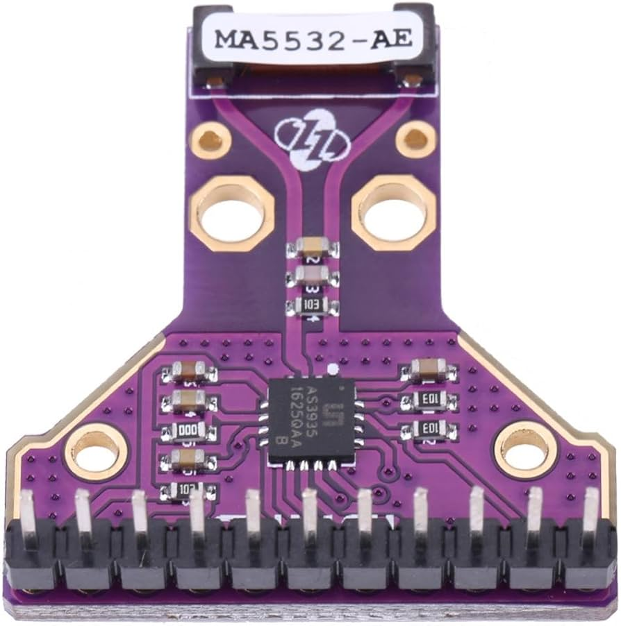

# Proyecto: Sensor de Rayos CJMCU-AS3935 para Raspberry Pi Pico con Micropython

Este repositorio contiene el código y los recursos necesarios para utilizar el sensor de rayos CJMCU-3935 con una Raspberry Pi Pico. Este sensor permite detectar descargas eléctricas atmosféricas y puede ser utilizado en diversos proyectos relacionados con la meteorología y la seguridad.

Sitio web del autor: [https://raupulus.dev](https://raupulus.dev)

Repository [https://gitlab.com/raupulus/rpi-pico-sensor-lightning-cjmcu-3935](https://gitlab.com/raupulus/rpi-pico-sensor-lightning-cjmcu-3935)

## Estado del proyecto: Versión 0.0.1 BETA

El proyecto aún está en una fase temprana de desarrollo, el código puede 
funcionar pero no completamente estable.

- La implementación para trabajar con la API aún no ha sido completada.
- El bus I2C es inestable al realizar lecturas, por SPI se consigue acceder a 
  los datos pero con una dudosa calibración de ruido que se debe optimizar.
- Debido a que no caen rayos cuando me interesa... la depuración y avance 
  del proyecto se torna un poco más lento de lo que me gustaría pero sigo 
  trabajando en él.

## Contenido del Repositorio

- **src/**: Código fuente del proyecto.
- **docs/**: Documentación adicional, esquemas y guías de instalación.

## Requisitos

Para utilizar este proyecto, necesitarás:

- **Hardware:**
  - Raspberry Pi Pico W.
  - Sensor CJMCU-AS3935.
  - Cables de conexión.

- **Software:**
  - [MicroPython](https://micropython.org/download/rp2-pico/) instalado en la Raspberry Pi Pico.
  - Un editor de texto o IDE compatible con Python.

## Instalación

1. **Configuración del Hardware:**
   - Conecta el sensor CJMCU-3935 a la Raspberry Pi Pico

2. **Instalación de MicroPython:**
   - Asegúrate de que MicroPython esté instalado en tu Raspberry Pi Pico. Puedes seguir las instrucciones en la [documentación oficial](https://docs.micropython.org/en/latest/rp2/quickref.html).

3. **Cargar el Código:**
   - Descarga o clona este repositorio.
   - Copia el archivo *.env.example.py* a *env.py* y rellena los datos para 
     conectar al wireless además de la ruta para subir datos a tu API.
   - Copia los archivos en la carpeta `src/` a la Raspberry Pi Pico.

## Licencia

Este proyecto está licenciado bajo la Licencia GPL-V3. Consulta el archivo 
LICENSE para más detalles.