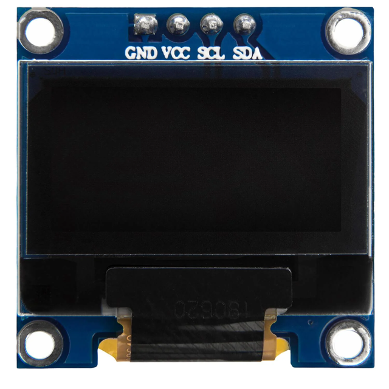

# Proyecto: Sensor de Rayos CJMCU-AS3935 para Raspberry Pi Pico con Micropython

Este repositorio contiene el código y los recursos necesarios para utilizar el sensor de rayos CJMCU-3935 con una Raspberry Pi Pico. Este sensor permite detectar descargas eléctricas atmosféricas y puede ser utilizado en diversos proyectos relacionados con la meteorología y la seguridad.

Sitio web del autor: [https://raupulus.dev](https://raupulus.dev)

Repository [https://gitlab.com/raupulus/rpi-pico-sensor-lightning-cjmcu-3935](https://gitlab.com/raupulus/rpi-pico-sensor-lightning-cjmcu-3935)

## Sobre el sensor CJMCU AS3935

El AS3935 es un sensor avanzado utilizado para la detección de rayos y tormentas eléctricas. Este sensor es capaz de identificar y analizar los pulsos electromagnéticos generados por las descargas de rayos, proporcionando información valiosa sobre la proximidad y la intensidad de una posible tormenta.

- **Interfaces de Conexión**:
  - **I2C**: El sensor AS3935 puede conectarse utilizando la interfaz I2C. Para este proyecto, se ha preparado el uso principal mediante I2C.
  - **SPI**: También es posible conectar el sensor utilizando la interfaz SPI, ofreciendo flexibilidad en la elección del modo de comunicación.

- **Dirección I2C**:
  - La dirección I2C del sensor AS3935 es `0x03`. Es importante tener en cuenta que esta dirección no se utiliza normalmente, ya que las direcciones desde `0x00` hasta `0x07` suelen estar reservadas para el uso del microcontrolador.
  - Para comprobar si el sensor está bien conectado, puedes intentar leer un byte directamente desde la dirección `0x03`.

## Como funciona la detección de rayos en el sensor CJMCU AS3935

## Detección de Rayos con el Sensor CJMCU AS3935

El sensor CJMCU AS3935 es un dispositivo diseñado para detectar la proximidad de rayos mediante la captura de las características únicas de los pulsos electromagnéticos generados por las descargas eléctricas durante una tormenta. A continuación se describe cómo funciona este proceso:

1. **Campo Eléctrico de las Descargas**:
   Las descargas de rayos producen fuertes campos eléctricos debido a la alta energía liberada. El sensor AS3935 puede detectar estos cambios en el potencial eléctrico.

2. **Tipos de Rayos**:
   Las descargas pueden ocurrir entre la nube y la tierra (principalmente, con una probabilidad del 75-90%) y entre nubes. Ambas generan pulsos electromagnéticos que el sensor puede detectar.

3. **Rango de Frecuencia**:
   El sensor AS3935 está sintonizado para captar los pulsos electromagnéticos de muy baja frecuencia (VLF) en el rango de 3 kHz a 30 kHz y las bandas de frecuencia extremadamente baja (ELF) por debajo de 3 kHz. La amplitud máxima de estas señales suele estar alrededor de 5-10 kHz.

4. **Detección de Pulsos Electromagnéticos**:
   Las descargas de rayos generan pulsos electromagnéticos rápidos (entre 10-150 ms) que el sensor puede detectar y analizar.

5. **Algoritmo de Detección**:
   El AS3935 cuenta con un algoritmo integrado y no modificable preparado para procesar estas señales, centrándose en un rango de frecuencia de aproximadamente 500 kHz. Este algoritmo ayuda a distinguir entre rayos reales y otras fuentes de ruido electromagnético, proporcionando información fiable sobre la cercanía y la posible intensidad de las tormentas eléctricas.

En resumen, el sensor CJMCU AS3935 es una herramienta eficaz para la detección temprana de rayos y tormentas eléctricas, ayudando a prevenir riesgos asociados a estas condiciones meteorológicas extremas.

## Pinout, esquema de conexiones entre la raspberry pi pico y el sensor

### Conexión mediante I2C

La dirección del sensor es **0x03**

| Pin del Sensor | Conexión |
|----------------|----------|
| VCC            | 3.3V     |
| GND            | GND      |
| MOSI (SDA)     | PIN 8    |
| SCL            | PIN 9    |
| SI             | 3.3V     |
| A0             | 3.3V     |
| A1             | 3.3V     |
| IRQ            | GPIO 22  |

### Conexión mediante SPI

> **⚠️ ADVERTENCIA:**
> 
> Ten en cuenta que no he terminado de probar la conexión por SPI y esta tabla puede estar mal, **verifícala antes de usarla**.

| Pin del Sensor | Conexión           |
|----------------|--------------------|
| VCC            | 3.3V               |
| GND            | GND                |
| MOSI           | MOSI (Master Out Slave In) |
| MISO           | MISO (Master In Slave Out) |
| SCLK           | SCK (Clock)        |
| CS             | Chip Select        |
| SI             | 3.3V               |
| A0             | 3.3V               |
| A1             | 3.3V               |
| IRQ            | GPIO (Interrupción)|

## Pantalla SSD1306

Opcionalmente puedes utilizar una pantalla SSD1306 en la que ver que ha 
encendido correctamente y además mostrará información del último rayo detectado.

El esquema de conexión es muy simple:

| Pin de la pantalla | Conexión |
|--------------------|----------|
| VCC                | 3.3V     |
| GND                | GND      |
| SDA                | PIN 8    |
| SCL                | PIN 9    |

En el proyecto, utilizo una con 128x64px que tiene la dirección para I2C: *0x3c*

## Leds para simular rayos

Se incluyen 3 Leds que simulan cada flash como si fueran rayos en los pines:

- GPIO 13
- GPIO 14
- GPIO 15

Cuando se producen eventos detectando relámpagos se encenderá este juego de
luces para que se aprecie visualmente que ha sido detectado al menos un rayo.

Su conexión es opcional, déjalos desconectados y simplemente no tendrás estos
destellos.

## Contenido del Repositorio

- **src/**: Código fuente del proyecto.
- **docs/**: Documentación adicional, esquemas y guías de instalación.

## Requisitos

Para utilizar este proyecto, necesitarás:

- **Hardware:**
  - Raspberry Pi Pico W.
  - Sensor CJMCU-AS3935.
  - Pantalla SSD1306 128x64px
  - 3 Leds
  - Cables de conexión.

- **Software:**
  - [MicroPython](https://micropython.org/download/rp2-pico/) instalado en la Raspberry Pi Pico.
  - Un editor de texto o IDE compatible con Python.

## Instalación

1. **Configuración del Hardware:**
   - Conecta el sensor CJMCU-3935 a la Raspberry Pi Pico

2. **Instalación de MicroPython:**
   - Asegúrate de que MicroPython esté instalado en tu Raspberry Pi Pico. Puedes seguir las instrucciones en la [documentación oficial](https://docs.micropython.org/en/latest/rp2/quickref.html).

3. **Cargar el Código:**
   - Descarga o clona este repositorio.
   - Copia el archivo *.env.example.py* a *env.py* y rellena los datos para 
     conectar al wireless además de la ruta para subir datos a tu API.
   - Copia los archivos en la carpeta `src/` a la Raspberry Pi Pico.

## Licencia

Este proyecto está licenciado bajo la Licencia GPL-V3. Consulta el archivo 
LICENSE para más detalles.